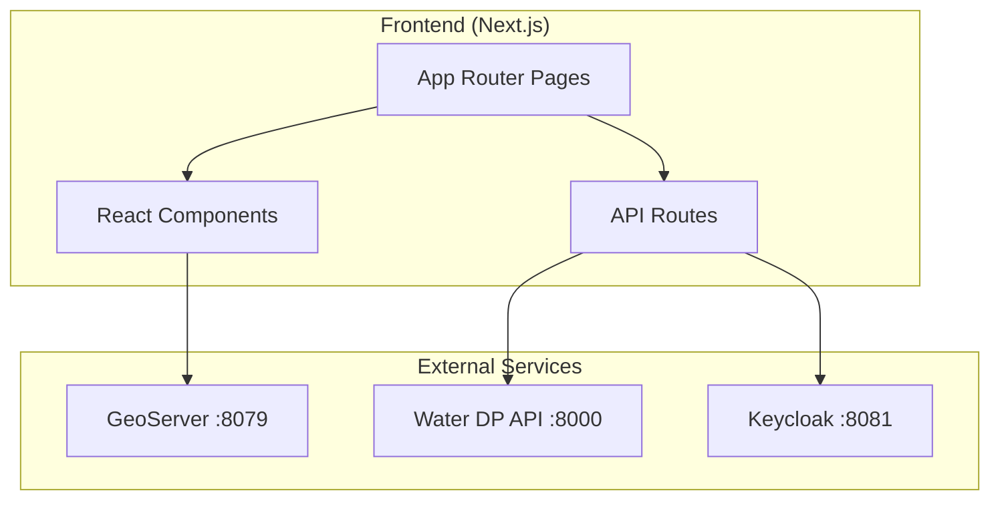

# Water DP - Hydro Portal (Frontend)

A modern Next.js dashboard for visualizing environmental sensor data, managing projects, and exploring geospatial layers.

## ✨ Features

- **🗺️ Interactive Maps**: Leaflet-based maps with sensor markers and GeoServer layers
- **📊 Data Visualization**: Time series charts with zoom and export
- **📁 Project Management**: Create projects and link sensors
- **🔐 Authentication**: Keycloak SSO integration via NextAuth.js
- **🔍 Sensor Browser**: Search and filter sensors from TSM
- **🤖 Simulator**: Create test sensors with simulated data

---

## 🏗️ Architecture



---

## 📁 Project Structure

```
frontend/
├── app/                      # Next.js App Router
│   ├── page.tsx              # Landing page
│   ├── layout.tsx            # Root layout
│   ├── globals.css           # Global styles
│   ├── api/                  # API routes (auth callbacks)
│   ├── auth/                 # Auth pages
│   ├── projects/             # Project pages
│   │   ├── page.tsx          # Project list
│   │   ├── [id]/             # Project detail
│   │   │   ├── sensors/      # Sensor list
│   │   │   ├── map/          # Map view
│   │   │   └── dashboard/    # Dashboard
│   └── groups/               # TSM group browser
├── components/
│   ├── ProjectMap.tsx        # Leaflet map component
│   ├── ProjectSidebar.tsx    # Navigation sidebar
│   ├── ProjectCard.tsx       # Project card widget
│   ├── DashboardCard.tsx     # Dashboard widget
│   ├── AppHeader.tsx         # Top navigation
│   ├── auth/                 # Auth components
│   ├── dashboard/            # Dashboard widgets
│   ├── data/                 # Data visualization
│   ├── parsers/              # Parser config UI
│   └── simulator/            # Simulator components
├── lib/                      # Utilities & API clients
├── types/                    # TypeScript definitions
└── public/                   # Static assets
```

---

## 🚀 Quick Start

### With Docker (Recommended)

The frontend is built and served as part of the main `docker-compose.yml`:

```bash
cd .. # Go to water_dp-api root
docker compose up -d frontend
```

Access at: http://localhost:3000

### Local Development

```bash
# Install dependencies
npm install

# Create environment file
cp .env.example .env.local

# Start dev server
npm run dev
```

Access at: http://localhost:3000

---

## ⚙️ Configuration

### Environment Variables

| Variable | Description | Example |
|----------|-------------|---------|
| `NEXT_PUBLIC_API_URL` | Water DP API base URL visible to the browser. Use a **relative path** when deployed behind a reverse proxy so the browser uses the same origin and avoids mixed-content issues. | `/water-api/api/v1` |
| `INTERNAL_API_URL` | API URL used by server-side code (Next.js server components, server actions). Points directly to the API container. | `http://water-dp-api:8000/api/v1` |
| `NEXT_PUBLIC_GEOSERVER_URL` | GeoServer URL (browser-facing, relative path preferred) | `/geoserver` |
| `AUTH_URL` / `NEXTAUTH_URL` | Base URL of the deployment **without** the `/portal` path prefix. Auth.js v5 automatically appends the Next.js `basePath` (`/portal`). Including `/portal` here causes redirect URL mismatches. | `https://your-domain.com` |
| `AUTH_SECRET` / `NEXTAUTH_SECRET` | Session encryption key — must be a strong random string | 32+ char random string |
| `AUTH_TRUST_HOST` | Set to `true` when behind a reverse proxy (nginx, Cloudflare, etc.) | `true` |

### Docker Build Args

When building with Docker, these are set at build time:

```yaml
args:
  - NEXT_PUBLIC_API_URL=http://localhost/water-api/api/v1
  - NEXT_PUBLIC_GEOSERVER_URL=http://localhost/geoserver
```

---

## 🧩 Key Components

### ProjectMap

Interactive Leaflet map displaying sensor locations and GeoServer layers.

```tsx
import ProjectMap from '@/components/ProjectMap';

<ProjectMap 
  projectId="uuid" 
  sensors={sensors}
  onSensorClick={(id) => console.log(id)}
/>
```

### Dashboard Widgets

Reusable dashboard components for data visualization:

- `SensorChart` - Time series line chart
- `SensorStats` - Summary statistics
- `AlertPanel` - Active alerts display

---

## 🔐 Authentication

Authentication uses **Auth.js v5** (next-auth) with a **credentials provider** backed by Keycloak. The API handles Keycloak communication; the frontend only exchanges a username/password for a JWT.

**Flow:**
1. User submits the sign-in form at `/portal/auth/signin`
2. A Next.js **server action** (`app/auth/signin/actions.ts`) calls `signIn("credentials", ...)` server-side
3. Auth.js calls the `authorize` function which POSTs to the API (`/auth/token`) using the OAuth2 password grant
4. The API forwards to Keycloak and returns an access + refresh token pair
5. Auth.js encrypts the tokens into a session cookie and redirects to `/portal/projects`
6. All subsequent API calls attach the `Authorization: Bearer <token>` header from the session

> **Why a server action instead of `signIn` from `next-auth/react`?**
> Auth.js v5 beta blocks direct POST to `/api/auth/callback/credentials` from the
> browser (`InvalidProvider` error). Calling `signIn()` from a server action
> bypasses this restriction while keeping the credentials out of client-side code.

**Token refresh:**
The session callback in `lib/auth.ts` automatically refreshes the access token
(via `POST /auth/refresh`) when it is within 10 seconds of expiry.

**Protected Routes:**
All routes under `/portal/projects/`, `/portal/sms/`, and `/portal/portal/` require authentication — enforced by `middleware.ts`.

---

## 🎨 Styling

- **Tailwind CSS** for utility-first styling
- **CSS Variables** for theming in `globals.css`
- **Dark Mode** support via Tailwind's dark variant

---

## 🧪 Development Scripts

```bash
# Development server with hot reload
npm run dev

# Production build
npm run build

# Start production server
npm run start

# Type checking
npm run type-check

# Linting
npm run lint
```

---

## 🐛 Troubleshooting

**Map not loading**
- Check GeoServer is running: `curl http://localhost:8079/geoserver/web/`
- Verify `NEXT_PUBLIC_GEOSERVER_URL` is correct

**API errors**
- Check backend is healthy: `curl http://localhost:8000/health`
- Verify `NEXT_PUBLIC_API_URL` is accessible from browser

**Auth redirect loop**
- Ensure `NEXTAUTH_URL` matches your actual URL
- Check Keycloak client redirect URIs include your frontend URL

---

## 📄 License

MIT License